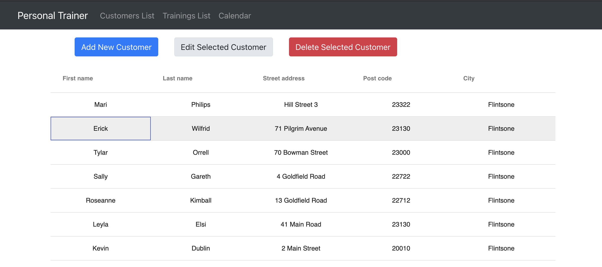
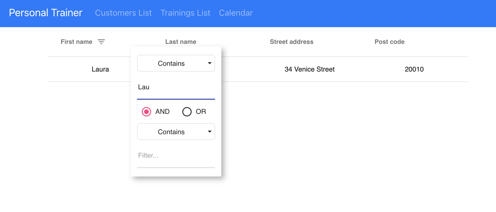

### Personal Trainer App

This is the final task for Front-end dev course, that each student implement individually.

#### Task description: 

Personal Trainer company needs front end app for their customer database. Database contains info about customers and their trainings. They have REST API and documentation that contains all information needed for front end development. 

(document with REST API documentation attached)

#### My progress: 

15.3.2021
Buttons added. By default Edit and Delete buttons disabled:

Add new customer form:

When some row selected buttons enabled:

Edit customer form:

Delete customer confirmation:

New buttons added for Trainings list.  By default Delete button disabled:

Add training form. Only existing customers can be selected:

When some row selected button enabled:

Delete training confirmation:

12.3.2021

